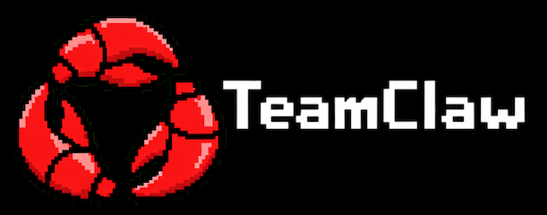
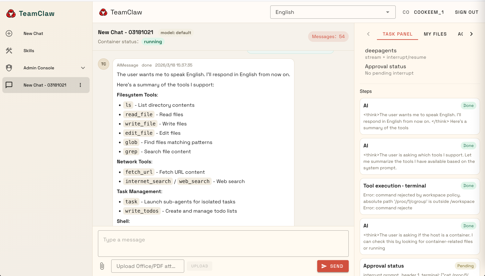
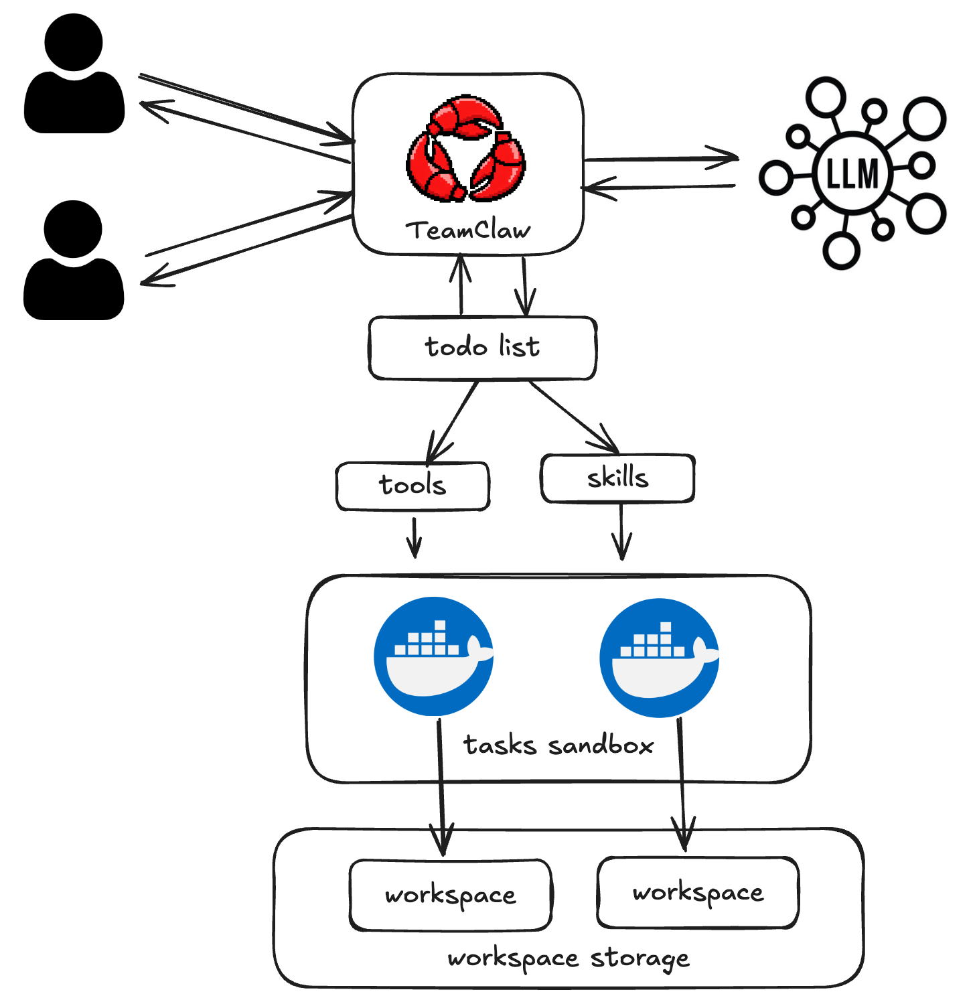

# TeamClaw - 面向多租户安全隔离的OpenClaw🦞



- [英文文档](README.md)
- [中文文档](README-zh.md)

- 项目地址:
  - [github.com/cookeem/teamclaw](https://github.com/cookeem/teamclaw)
  - [gitee.com/cookeem/teamclaw](https://gitee.com/cookeem/teamclaw)

## TeamClaw是什么？
- TeamClaw 名字灵感来自 openclaw 小龙虾 —— 是一个面向团队多租户场景的智能任务代理，通过聊天的方式帮你自动生成任务执行清单，并在隔离的容器环境中执行任务，让复杂任务变得安全、可控、可追踪。
- 底层智能代理基于 LangChain 的 DeepAgents，后端基于 FastAPI，前端为静态页面（Vue + Vuetify），可通过 Docker 一键部署。



## TeamClaw任务执行流程



- 用户在TeamClaw创建对话，与LLM大模型对话，LLM大模型理解用户的需求，并通过TeamClaw生成任务清单(todo list)
- TeamClaw读取任务清单(todo list)，为每个用户对话自动创建docker容器，并在容器中挂装对话的workspace作为数据存储
- 用户通过TeamClaw确认是否执行任务清单
- TeamClaw在docker容器中执行任务，任务可能要调用tools，也可能需要调用skills
- 任务执行过程和执行结果通过TeamClaw反馈给用户

### TeamClaw相关组件

- postgres: TeamClaw数据库，用于存放用户/对话/技能等数据
- docker in docker(dind): TeamClaw的对话任务执行的sandbox，隔离每个用户对话的任务和数据

## 主要功能
- 支持多种LLM模型: openai / ollama / anthropic / google_gemini / google_vertexai / azure_openai / xai / together / mistralai / cohere / bedrock
- 支持通过对话生成任务清单 todo_list
- 支持自动调用 tools/skills 执行任务
- 支持每个对话中的 tools/skills 任务在独立的容器中执行
- 支持多租户，通过独立的对话容器以隔离方式执行任务
- 支持通过对话创建和执行 skills
- 支持skill的发布与共享
- 任务执行可以通过人工确认再执行，让任务执行更加安全可控
- 支持上传 Office/PDF 文件到对话workspace，再通过任务处理上传的文件

## 快速安装（Docker）
1. 拉取源代码
```bash
git clone https://github.com/cookeem/teamclaw.git
cd teamclaw
```

2. 修改配置文件
  - docker方式部署使用 `docker-compose-docker.yaml`启动服务，使用 `config-docker.yaml` 作为配置文件
  - 请编辑 `config-docker.yaml`，修改如下配置:
    - models.providers: 模型参数配置
    - api_keys.tavily: tavily internet_search tools api key
    - smtp: 邮件发送配置

3. 启动服务
```bash
# 生成docker daemon证书，证书保存在 ./certs 目录
sh docker_certs.sh

# 启动TeamClaw服务，同时会启动 postgres / docker-0.docker / docker-1.docker
docker compose -f docker-compose-docker.yaml up -d
```
4. 访问服务
  - 前端：http://localhost:8080/frontend/
  - 后端：http://localhost:8000/docs

## 本地安装（开发调试）

1. 拉取源代码
```bash
git clone https://github.com/cookeem/teamclaw.git
cd teamclaw
```

2. 修改配置文件
  - 本地方式部署使用 `docker-compose.yaml`启动服务，使用 `config.yaml` 作为配置文件
  - 请编辑 `config.yaml`，修改如下配置:
    - models.providers: 模型参数配置
    - api_keys.tavily: tavily internet_search tools api key
    - smtp: 邮件发送配置

3. 启动服务
```bash
# 生成docker daemon证书，证书保存在 ./certs 目录
sh docker_certs.sh

# 启动 postgres / docker-0.docker / docker-1.docker
docker compose -f docker-compose-docker.yaml up -d

# 使用venv创建虚拟环境，并安装相关依赖
# 假如要使用 openai / ollama 之外的模型
# 请修改 requirements-models.txt 安装相关模型依赖
python3 -m venv venv
source venv/bin/activate
python -m pip install -U pip
python -m pip install -r requirements.txt
python -m pip install -r requirements-models.txt

# 启动backend后端服务
python3 -m backend.main

# 启动frontend前端服务
python3 -m http.server 8080
```
4. 访问服务
  - 前端：http://localhost:8080/frontend/
  - 后端：http://localhost:8000/docs

## 构建docker镜像

```bash
# 拉取代码
git clone https://github.com/cookeem/teamclaw.git
cd teamclaw

# 假如要使用 openai / ollama 之外的模型
# 请修改 requirements-models.txt 安装相关模型依赖
vi requirements-models.txt

# 构建镜像
docker build -t yourname/teamclaw:dev .
```

