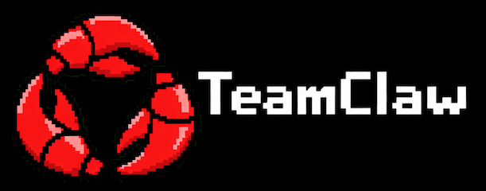
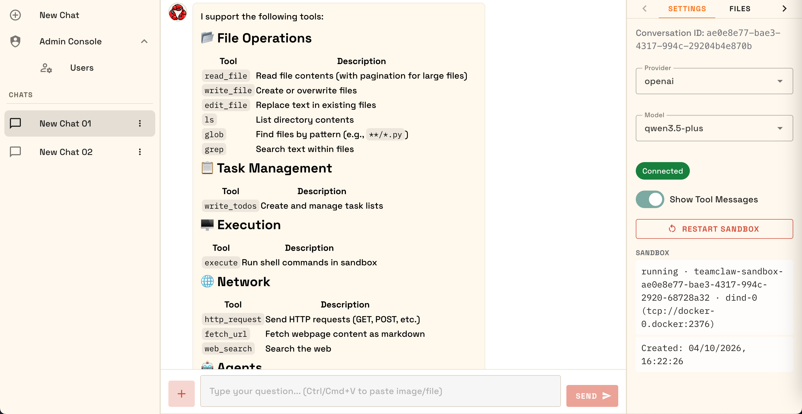
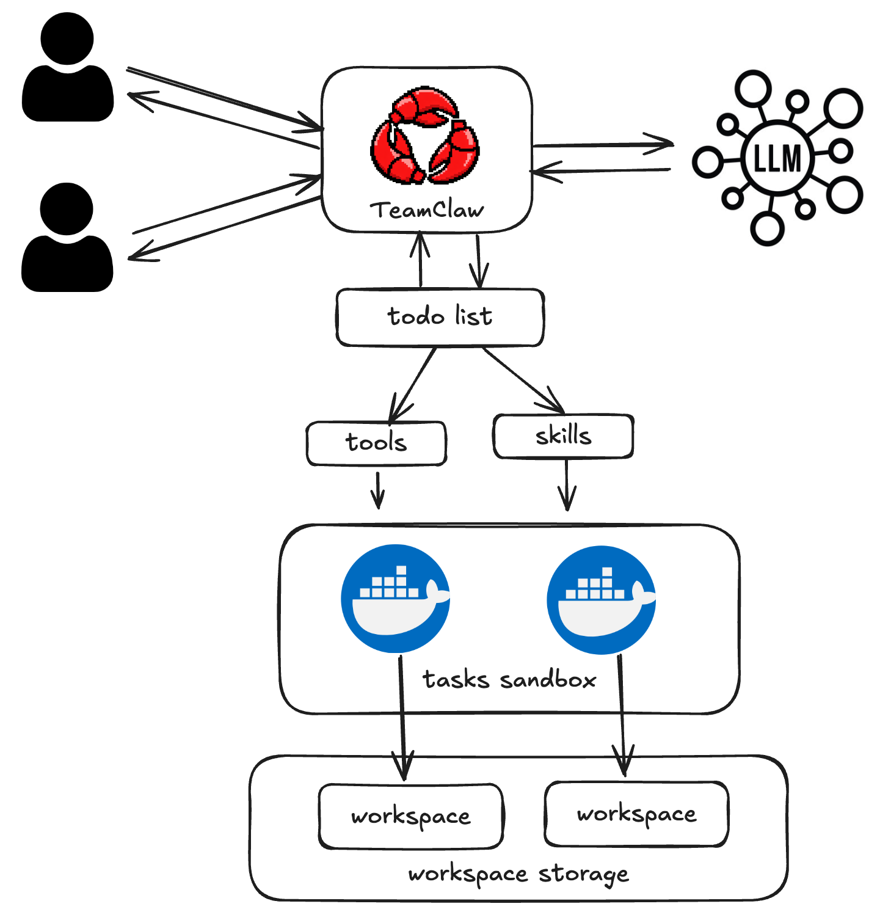

# TeamClaw - 面向多租户安全隔离的OpenClaw🦞



- [英文文档](README.md)
- [中文文档](README-zh.md)

- 项目地址:
  - [github.com/cookeem/teamclaw](https://github.com/cookeem/teamclaw)
  - [gitee.com/cookeem/teamclaw](https://gitee.com/cookeem/teamclaw)

## TeamClaw是什么？
- TeamClaw —— 是一个面向团队多租户场景的智能任务代理，通过聊天的方式帮你自动生成任务执行清单，并在隔离的容器环境中执行任务，让复杂任务变得安全、可控、可追踪。
- 底层智能代理基于 LangChain 的 DeepAgents，后端基于 FastAPI，前端为静态页面（Vue + Vuetify），可通过 Docker 一键部署。



## TeamClaw任务执行流程



- 用户在TeamClaw创建对话，与LLM大模型对话，LLM大模型理解用户的需求，并通过TeamClaw生成任务清单(todo list)
- TeamClaw读取任务清单(todo list)，为每个用户对话自动创建docker容器，并在容器中挂装对话的workspace作为数据存储
- TeamClaw在docker容器中执行任务，任务可能要调用tools，也可能需要调用skills
- 任务执行过程和执行结果通过TeamClaw反馈给用户

### TeamClaw相关组件

- postgres: TeamClaw数据库，用于存放用户/对话等数据
- docker in docker(dind): TeamClaw的对话任务执行的sandbox，隔离每个用户对话的任务和数据

## 主要功能
- 支持多种LLM模型: openai / ollama / anthropic / google_gemini / google_vertexai / azure_openai / xai / together / mistralai / cohere / bedrock
- 支持自动调用 tools/skills 执行任务，任务在容器sandbox中执行
- 支持多租户，通过独立的对话容器以隔离方式执行任务
- 支持通过对话创建和执行 skills
- 支持通过对话创建和管理计划任务
- 支持上传 Office/PDF 文件到对话workspace，再通过任务处理上传的文件

## 快速安装（Docker）
1. 拉取源代码
```bash
git clone https://github.com/cookeem/teamclaw.git
cd teamclaw
```

2. 修改配置文件
  - docker方式部署使用 `docker-compose-docker.yaml`启动服务，使用 `config-docker.yaml` 作为配置文件
  - 请编辑 `config-docker.yaml`，修改如下配置:
    - models.providers: 模型参数配置
    - smtp: 邮件发送配置

3. 启动服务
```bash
# 复制文件到data/teamclaw目录，并生成docker daemon证书
# 证书保存在 data/teamclaw/certs 目录
mkdir -p data/teamclaw
cp -rp config-docker.yaml docker_certs.sh prompts skills-builtin data/teamclaw
cd data/teamclaw
sh docker_certs.sh
cd ../..

# 启动TeamClaw服务，同时会启动 postgres / docker-0.docker / docker-1.docker
docker compose -f docker-compose-docker.yaml up -d
```
4. 访问服务
  - 前端：http://localhost:8080/
  - 后端：http://localhost:8000/docs

## 本地安装（开发调试）

1. 拉取源代码
```bash
git clone https://github.com/cookeem/teamclaw.git
cd teamclaw
```

2. 修改配置文件
  - 本地方式部署使用 `docker-compose.yaml`启动服务，使用 `config.yaml` 作为配置文件
  - 请编辑 `config.yaml`，修改如下配置:
    - models.providers: 模型参数配置
    - smtp: 邮件发送配置

3. 启动服务
```bash
# 生成docker daemon证书，证书保存在 ./certs 目录
sh docker_certs.sh

# 启动 postgres / docker-0.docker / docker-1.docker
docker compose up -d

# 进入backend目录启动backend后端服务
cd backend
python3 -m venv .venv
source .venv/bin/activate
pip install -r requirements.txt
uvicorn app.main:app --host 0.0.0.0 --port 8000 --reload

# 进入frontend目录启动frontend前端服务
cd frontend
npm install
npm run dev
```

4. 访问服务
  - 前端：http://localhost:8080/frontend/
  - 后端：http://localhost:8000/docs

## 构建docker镜像

```bash
# 拉取代码
git clone https://github.com/cookeem/teamclaw.git
cd teamclaw

# 构建镜像
cd frontend
npm install
npm run build
cd ..

export DOCKERHUB_USER=username
export VERSION=version
docker build \
  --platform linux/amd64 \
  -f docker/teamclaw/Dockerfile \
  --build-arg APT_MIRROR=mirrors.aliyun.com \
  --build-arg PIP_INDEX_URL=https://mirrors.aliyun.com/pypi/simple/ \
  --build-arg PIP_TRUSTED_HOST=mirrors.aliyun.com \
  --build-arg NPM_REGISTRY=https://registry.npmmirror.com \
  -t ${DOCKERHUB_USER}/teamclaw:${VERSION} .
```
